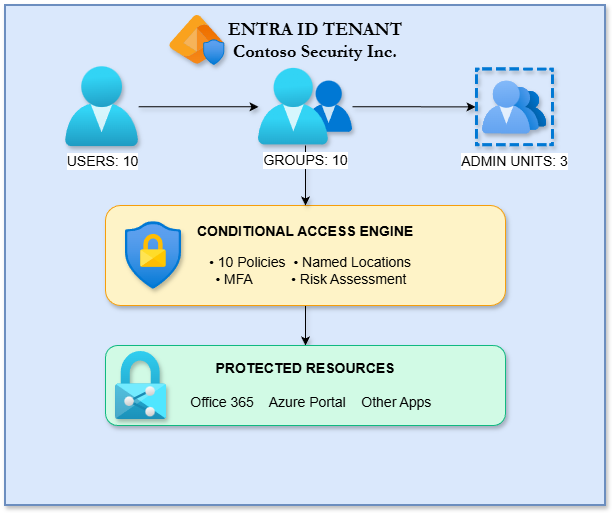

# Azure Identity & Access Management Project

## 🎯 Project Overview

A comprehensive **enterprise identity and access management solution** built on Microsoft Entra ID for a fictional company "Contoso Security Inc." This project demonstrates practical implementation of Zero Trust security principles using Microsoft's identity platform.

### What I Built

- ✅ Microsoft Entra ID tenant configuration from scratch
- ✅ User lifecycle management with groups and administrative units
- ✅ Self-service password reset (SSPR) implementation
- ✅ Multi-factor authentication (MFA) enforcement
- ✅ **10 Conditional Access policies** implementing Zero Trust principles
- ✅ Emergency break glass account procedures

---

## 🏗️ Architecture

### Components

| Component | Purpose |
|-----------|---------|
| **Users (10)** | Employees across departments + break glass accounts |
| **Security Groups (9)** | Role-based access control including dynamic groups |
| **Administrative Units (3)** | Delegated administration boundaries |
| **Conditional Access (10)** | Zero Trust policy enforcement |
| **Named Locations (3)** | Geographic-based access control |

---

## 🛡️ Conditional Access Policy Framework

| # | Policy | Purpose | Status |
|---|--------|---------|--------|
| 001 | Block Legacy Authentication | Prevent insecure protocol usage | ✅ Implemented |
| 002 | Require MFA for All Users | Universal MFA enforcement | ✅ Implemented |
| 003 | Block High-Risk Countries | Geographic restrictions | ✅ Implemented |
| 004 | Require MFA for Admins | Enhanced admin protection | ✅ Implemented |
| 005 | Require MFA for Risky Sign-ins | Risk-based authentication | ✅ Implemented |
| 006 | Block High-Risk Users | Compromised account protection | ✅ Implemented |
| 007 | Require Compliant Device | Device trust verification | ✅ Implemented |
| 008 | Restrict Azure Portal | Management plane protection | 📝 Documented |
| 009 | Session Controls for External | Guest user restrictions | ✅ Implemented |
| 010 | Enhanced Security for Executives | VIP protection | ✅ Implemented |

➡️ [View detailed policy documentation](policies/)

---

## 🔐 Security Principles Implemented

### Zero Trust Model
> "Never trust, always verify"

- **Verify explicitly:** Every access request authenticated via MFA
- **Least privilege:** Role-based group membership
- **Assume breach:** Break glass procedures, risk-based policies

### Defense in Depth
